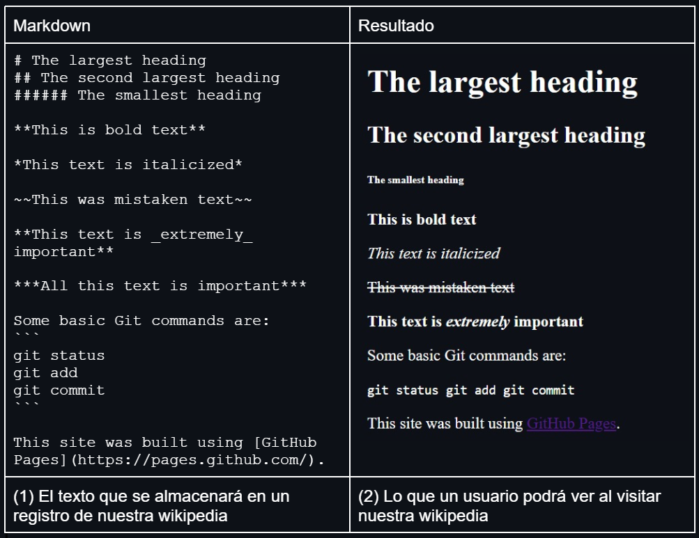

<table>
    <theader>
        <tr>
            <td></td>
            <th>
                UNIVERSIDAD NACIONAL DE SAN AGUSTIN 
                FACULTAD DE INGENIERÍA DE PRODUCCIÓN Y SERVICIOS 
                ESCUELA PROFESIONAL DE INGENIERÍA DE SISTEMAS
            </th>
            <td></td>
        </tr>
    </theader>
    <tbody>
        <tr><td colspan="3">Formato: Guía de Práctica de Laboratorio</td></tr>
        <tr><td>Aprobación:  2022 </td><td>Código: GUIA-PRLD-001</td><td>Página: 1</td></tr>
    </tbody>
</table>

 <h3>INFORME DE LABORATORIO</h3>

<table>
 <theader>
  <tr><th colspan="6" bgcolor="red">INFORMACIÓN BÁSICA</th></tr>
 </theader>
 <tbody>
  <tr><td>ASIGNATUA:</td><td colspan="5">Programacion Web 1 </td></tr>
  <tr><td>TÍTULO DE LA PRACTICA:</td><td colspan="4">Proyecto final (I Entrega) <td></tr>
  <tr><td>NÚMERO DE PRÁCTICA:</td><td>Practica de Laboratorio 12</td><td>AÑO LECTIVO:</td><td>2022-B</td><td>NRO. SEMESTRE:</td><td>II</td></tr>
  <tr><td>FECHA DE PRESENTACIÓN:</td><td> **-Dic-2022</td><td>HORA DE PRESENTACIÓN:</td><td colspan="3">11:30 p.m.</td></tr>

  <tr><td>INTEGRANTES:</td><td colspan="3">Aguilar Tancayo Edwin Francisco.  Cáceres Apaza Jherald Huren. ------------------------- ------------------- -------------------</td><td>NOTA:</td><td>...</td></tr>

  <tr><td>DOCENTE:</td><td colspan="5">Richart Smith Escobedo Quispe - rescobedoq@unsa.edu.pe</td></tr>
 </tbody>
</table>
<table>
 <theader>
  <tr><th>SOLUCIÓN Y RESULTADOS</th></tr>
 </theader>
 <tbody>
  <tr><td><strong>I. SOLUCIÓN DE EJERCICIOS/PROBLEMAS:</strong> 
  <ul>
    <h4>  Markdown  </h4> 
      
Markdown es una herramientaque permite escribir páginas web sin tener conocimiento de HTML    
         IMAGEN
      

      
     <h4>  Index.html  </h4> 
      
Pagina de presentacion del laboratorio   
         IMAGEN
      

     <h4>  View.html  </h4> 
      
Pagina para introducir el contenido que se desea convertir a una pagina web    
         IMAGEN
      

    <h4>  cgi-bin  </h4>
      <ol>  
          <li> Delete.pl </li>
          
 io sono starosa ,colui a cui e estato conceso il comandamento del amore, perche nell amore ce sempre un orologio  
               que fa tic tac che sempre un conto alla non vasta amare qualquno devi arrivare in tempo  
              fuoco
          

          <li> Edit.pl </li>
            
................................................................................................................  
               .................................................................................................................
            
  
          <li> List.pl </li>
           
................................................................................................................  
               .................................................................................................................
           
 
          <li> View.pl </li>
           
................................................................................................................  
               .................................................................................................................
           
 
          <li> New.pl </li>
           
................................................................................................................  
               .................................................................................................................
           

      </ol>
     <h4>  Index.html  </h4>
           
................................................................................................................  
               .................................................................................................................
           
   
  </ul>

  <tr><td><strong>II. CONCLUSIONES:</strong> - ........................................................................ 
  - ................................................................................................... 
  - ............................................................... 
  - ............................................................... </td></tr>
 </tbody>
</table>

<table>
 <theader>
  <tr><td><strong>III. RETROALIMENTACIÓN GENERAL</strong> 
  </td><tr>
 </theader>
 <tbody>
  <tr><td>- ......................................
  </td></tr>
 </tbody>
</table>

<table>
 <theader>
  <tr><td><strong>REFERENCIAS Y BIBLIOGRAFÍA</strong></td><tr>
 </theader>
 <tbody>
  <tr><td>Ref 1</td></tr>
  <tr><td>Ref 2</td></tr>
  <tr><td>...</td></tr>
  <tr><td>...</td></tr>
  <tr><td>...</td></tr>
 </tbody>
</table>
